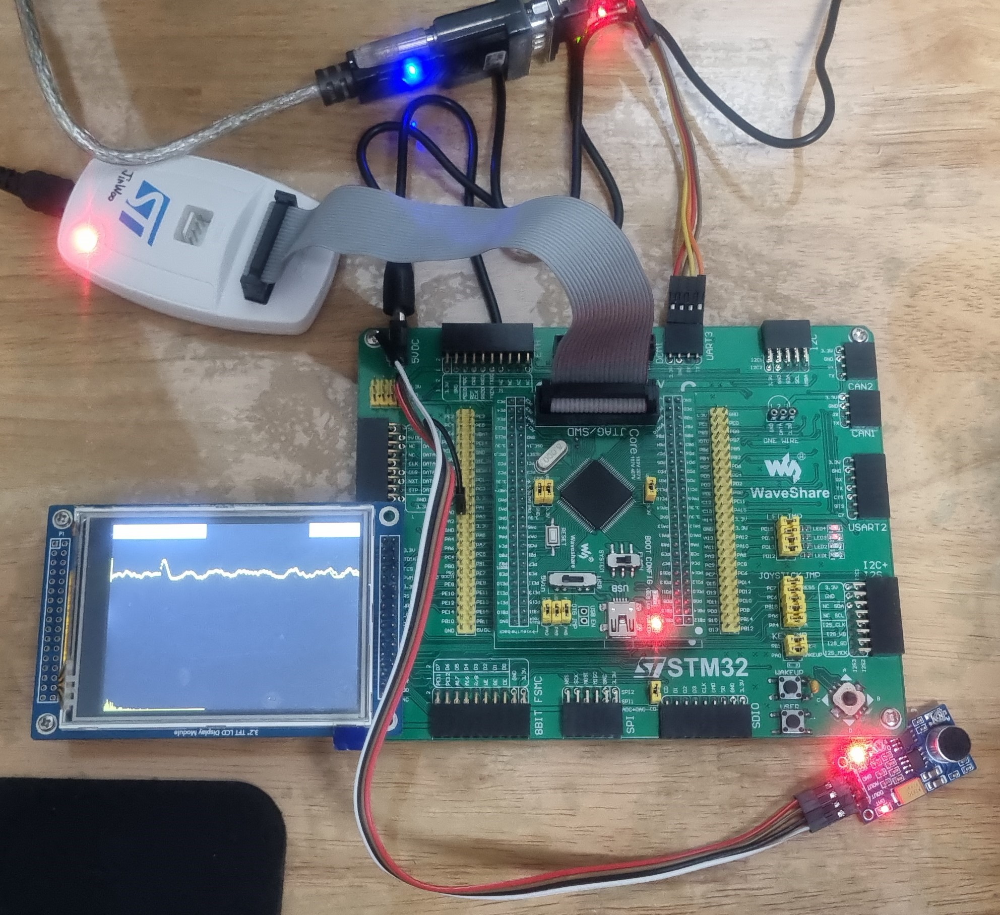

# Prj_FFT_STM32 — 실시간 FFT 스펙트럼 분석기



> STM32F407 Core 보드 + 3.2" TFT LCD(FSMC) + ST-Link/JTAG, UART3, 마이크 모듈 연결 구성. 상단에 시간 도메인 파형, 하단에 FFT 스펙트럼이 표시됩니다.

STM32F407 보드에서 ADC로 입력 신호를 샘플링하고, CMSIS-DSP의 radix-4 복소 FFT로 주파수 성분을 분석하여 TFT LCD에 **시간 도메인 파형**과 **주파수 스펙트럼**을 실시간으로 표시하는 펌웨어입니다. 선택적으로 UART를 통해 PC(C# 모니터)로 원본/FFT 데이터를 전송할 수 있습니다.

## 주요 기능

- **실시간 ADC 샘플링** — DMA 기반 ADC1 연속 변환 (8비트 해상도)
- **FFT 연산** — ARM CMSIS-DSP `arm_cfft_radix4_f32`, 256포인트 복소 FFT + 크기(magnitude) 계산
- **LCD 시각화** — 320×240 ILI9325 패널에 시간 도메인 뷰(상단)와 FFT 뷰(하단) 동시 표시
- **UART 모니터(옵션)** — UART3(115200 bps)로 원본 샘플 프레임 + FFT 결과 프레임 전송
- **터치 패널 캘리브레이션** — 부팅 시 터치 보정 수행

## 하드웨어 요구사항

| 항목 | 사양 |
|------|------|
| MCU | STM32F407VET6 (Cortex-M4F, 168 MHz) |
| 보드 | OpenX07V-C 계열 (Embest) |
| 디스플레이 | ILI9325 TFT LCD, 320×240, FSMC 인터페이스 |
| 터치 | 저항막 터치 패널 (SPI) |
| ADC 입력 | ADC1 Channel 0 — 분석할 아날로그 신호 입력 |
| 디버거 | ST-Link |

## 신호 처리 사양

- **샘플링 타이머**: TIM7 (PSC=9, ARR=949, APB1 타이머 클럭 84 MHz)
- **FFT 크기**: 256 포인트 (`FFT_SIZE`), 입력 버퍼 512 (`SAMPLES`, 실수+허수 인터리브)
- FFT는 256개 샘플이 채워질 때마다 한 번 수행됩니다.

> 자세한 타이밍(프레임 주기, UART 전송 시간 등)은 [`Core/Inc/main.h`](Core/Inc/main.h)의 주석을 참고하세요.

## 핵심 동작 원리 — FFT 파이프라인

이 펌웨어의 심장부는 [`Core/Src/main.c`](Core/Src/main.c)의 다음 3개 CMSIS-DSP 함수 호출입니다. 시간 영역으로 수집한 ADC 샘플을 주파수 영역의 스펙트럼으로 변환하는 핵심 연산이며, 256개 샘플이 모일 때마다 한 번씩 실행됩니다.

```c
arm_cfft_radix4_init_f32(&S, FFT_SIZE, 0, 1);  // 1) FFT 인스턴스 초기화
arm_cfft_radix4_f32(&S, Input);                // 2) 복소 FFT 수행 (in-place)
arm_cmplx_mag_f32(Input, Output, FFT_SIZE);    // 3) 각 주파수 빈의 크기(magnitude) 계산
```

### 입력 데이터 구조: 왜 버퍼가 512인가?

FFT는 **복소수(complex)** 를 다루므로 한 샘플마다 `[실수부, 허수부]` 두 개의 `float32`가 필요합니다. 따라서 256포인트 FFT를 위해 `Input[512]` 버퍼에 다음과 같이 인터리브(interleave)되어 저장됩니다.

```
Input[] = [ re0, im0, re1, im1, re2, im2, ... , re255, im255 ]
            ▲    ▲
            │    └─ 허수부 = 0 (실제 신호이므로)
            └─ 실수부 = ADC 측정값 (AdcVal/4)
```

`main.c`에서 `memmove`로 버퍼를 2칸씩 밀고 `Input[0]`에 새 ADC 값을, `Input[1]`에 0을 넣는 이유가 바로 이 구조 때문입니다.

### 단계별 설명

**1️⃣ `arm_cfft_radix4_init_f32(&S, FFT_SIZE, 0, 1)` — 초기화**

FFT 연산에 필요한 트위들 팩터(twiddle factor) 테이블과 비트 반전(bit-reversal) 테이블 등의 정보를 인스턴스 구조체 `S`에 채웁니다.

| 인자 | 값 | 의미 |
|------|----|------|
| `&S` | — | radix-4 CFFT 인스턴스 구조체 포인터 |
| `fftLen` | `FFT_SIZE` (256) | FFT 포인트 수 (radix-4이므로 16, 64, 256, 1024 … 4의 거듭제곱이어야 함) |
| `ifftFlag` | `0` | 0 = 정방향 FFT(시간→주파수), 1 = 역방향 IFFT |
| `bitReverseFlag` | `1` | 1 = 출력을 정상 순서로 정렬(비트 반전 적용) |

> 매 사이클마다 초기화를 다시 호출하고 있는데, 파라미터가 고정이라면 초기화는 시작 시 1회만 해도 됩니다. (향후 최적화 포인트)

**2️⃣ `arm_cfft_radix4_f32(&S, Input)` — 복소 FFT 수행**

radix-4 분할 정복(divide-and-conquer) 알고리즘으로 고속 푸리에 변환을 수행합니다. 한 번에 4개씩 묶어 처리하므로 radix-2보다 곱셈 횟수가 적어 **Cortex-M4F의 FPU**와 함께 빠르게 동작합니다.

- **in-place 연산**: 결과가 입력 버퍼 `Input`을 **덮어씁니다**. 즉, 시간 영역 데이터가 주파수 영역의 복소수 스펙트럼 `[re, im]`으로 변환됩니다.
- 출력 역시 256개의 복소수(512 float)로, 각 원소는 해당 주파수 빈의 실수부/허수부입니다.

**3️⃣ `arm_cmplx_mag_f32(Input, Output, FFT_SIZE)` — 크기 계산**

복소수 스펙트럼은 그대로 화면에 그릴 수 없으므로, 각 주파수 빈의 **크기(magnitude)** 로 변환합니다.

```
Output[k] = sqrt( re[k]² + im[k]² )      (k = 0 … 255)
```

이렇게 얻은 `Output[256]`이 각 주파수 성분의 세기이며, `main.c`에서 이 값을 LCD 하단의 막대 그래프(FFT 뷰)로 그립니다. (낮은 인덱스 = 저주파, 높은 인덱스 = 고주파)

### 전체 흐름 요약

```
ADC(DMA) ──> Input[](512, 실/허수 인터리브) ──> [FFT] ──> 복소 스펙트럼(Input 덮어씀)
                                                              │
                                                       [magnitude]
                                                              ▼
                                                       Output[](256) ──> LCD FFT 뷰 / UART 전송
```

### Excel 방법과 본 펌웨어 구현의 대응 관계

Excel로 익힌 개념이 CMSIS-DSP 구현에 그대로 매핑됩니다.

| Excel 방법 (PDF) | 본 펌웨어 구현 |
|------------------|----------------|
| Fourier Analysis → `FFT complex` 열 (복소수 결과) | `arm_cfft_radix4_f32()` 출력 (복소 스펙트럼) |
| `=2/sa * IMABS(E2)` → `FFTmag` 열 (크기) | `arm_cmplx_mag_f32()` → `Output[]` |
| `FFT freq = n × fs / sa` (주파수 분해능) | 빈 간격 = 샘플링 주파수 / `FFT_SIZE` |
| 샘플 수는 2ⁿ(256/512/1024 …)이어야 함 | `FFT_SIZE = 256` (radix-4는 4의 거듭제곱) |
| "sa/2 이상은 그리지 말 것(스펙트럼이 반복됨)" | `main.c`에서 `FFT_SIZE/2`까지만 LCD에 표시 |

> 즉, Excel은 **알고리즘 검증·시각화 도구**로, STM32 펌웨어는 이를 **실시간으로 구현한 결과**로 볼 수 있습니다.

## 빌드 & 플래시

본 프로젝트는 **STM32CubeIDE** 프로젝트입니다.

1. STM32CubeIDE 실행 → `File > Open Projects from File System...`
2. 이 저장소 폴더를 선택하여 import
3. 프로젝트 빌드 (`Project > Build All`, 또는 망치 아이콘)
4. ST-Link 연결 후 `Run > Debug` 로 플래시 및 디버깅

CMSIS-DSP(`arm_math`) 라이브러리는 STM32 펌웨어 패키지에 포함되어 있으며, 빌드 설정에 의존성이 구성되어 있습니다.

CubeMX로 주변장치 설정을 수정하려면 [`FFT_Mutex.ioc`](FFT_Mutex.ioc) 파일을 사용하세요.

## 설정 옵션

UART 모니터 기능은 컴파일 타임 매크로로 켜고 끌 수 있습니다 — [`Core/Inc/main.h`](Core/Inc/main.h):

```c
#define ENABLE_UART_MONITOR  1   // 0 = 비활성화
```

활성화 시 매 FFT 사이클마다 UART3로 두 종류의 프레임을 전송합니다:

- **원본 프레임**: `0x03 0x15 0x01` 헤더 + 길이(2바이트) + 1바이트 샘플 데이터
- **FFT 프레임**: `0x03 0x15 0x02` 헤더 + 길이(2바이트) + float32(리틀엔디안) 크기 데이터

인코딩 로직은 [`Core/Src/main.c`](Core/Src/main.c)의 `Encode_Message_Raw` / `Encode_Message_FFT_f32` 함수에 있습니다.

## 프로젝트 구조

```
Prj_FFT_STM32/
├── Core/
│   ├── Inc/            # 헤더 (main.h, 주변장치, LCD, 터치, 폰트)
│   ├── Src/            # 소스 (main.c, FFT/LCD/ADC 로직, 드라이버)
│   └── Startup/        # 스타트업 어셈블리
├── Drivers/            # STM32 HAL & CMSIS
├── docs/
│   ├── hardware_demo.jpg       # 동작 사진
│   └── references/             # FFT 참고 자료 (PDF, Excel 예제)
├── FFT_Mutex.ioc       # STM32CubeMX 설정 파일
├── *.ld                # 링커 스크립트 (FLASH / RAM)
└── README.md
```

## 향후 개선 계획

현재 펌웨어는 **단일 코어(Single Core) / 단일 `while` 루프** 구조로 동작합니다.

- **FFT 동작**: 메인 루프에서 연속적으로 처리되므로 화면 갱신이 끊기지 않고 부드럽게 동작합니다.
- **UART 전송 시 끊김**: `HAL_UART_Transmit(... HAL_MAX_DELAY)` 기반의 **블로킹(Sleep) 방식**으로 데이터를 전송하기 때문에, UART 모니터(`ENABLE_UART_MONITOR`)를 켜면 전송이 끝날 때까지 CPU가 대기하면서 FFT/LCD 갱신이 멈추는 끊김 현상이 발생합니다. (1 FFT 사이클당 원본 프레임 약 22 ms + FFT 프레임 약 89 ms @115200, 자세한 내용은 `Core/Inc/main.h` 주석 참조)

**개선 방향**

- **FreeRTOS 도입** — 신호 샘플링/FFT 연산 태스크와 UART 전송 태스크를 분리하여 UART 전송이 FFT·LCD 갱신을 막지 않도록 한다.
- **MUTEX(상호 배제) 적용** — 두 태스크가 공유하는 FFT 결과 버퍼(`Input`/`Output`)를 뮤텍스로 보호하여 데이터 경합(race condition)을 방지한다.
- (옵션) UART 전송을 인터럽트/DMA 기반(`HAL_UART_Transmit_DMA`)으로 전환하여 블로킹 대기 자체를 제거한다.

## 참고 자료 (References)

FFT를 펌웨어로 구현하기에 앞서, **Excel로 시간 영역 → 주파수 영역 변환 과정을 먼저 검증**하며 원리를 이해했습니다. 아래 자료를 참고했습니다.

- **[Frequency Domain Using Excel](docs/references/Excel_FFT_Instructions.pdf)** — Larry Klingenberg, San Francisco State University, School of Engineering (April 2005)
  - Excel의 *Analysis ToolPak → Fourier Analysis* 기능으로 샘플 데이터를 FFT 복소수로 변환하고, 크기 스펙트럼을 그리는 단계별 가이드
- **[FFT 예제 스프레드시트](docs/references/FFT_example.xlsx)** — Signal Generator로 주파수를 생성하고 이를 Oscilloscope에 연결하여 그 데이터를 엑셀로 추출해서 위의 가이드를 통해서 동일하게 작업을 진행했고, 이를 통해서 어떤 FFT를 구현하기 위해서 중요한 척도 및 파라미터가 무엇인지 공부할 수 있었음.
  - 컬럼 구성: `second`(시간) · `Volt`(샘플 데이터) · `FFT Freq` · `FFT complex` · `FFTmag`, 파라미터: `Data length(D)`, `sampling time(t)`, `sampling Freq(Fs)`
