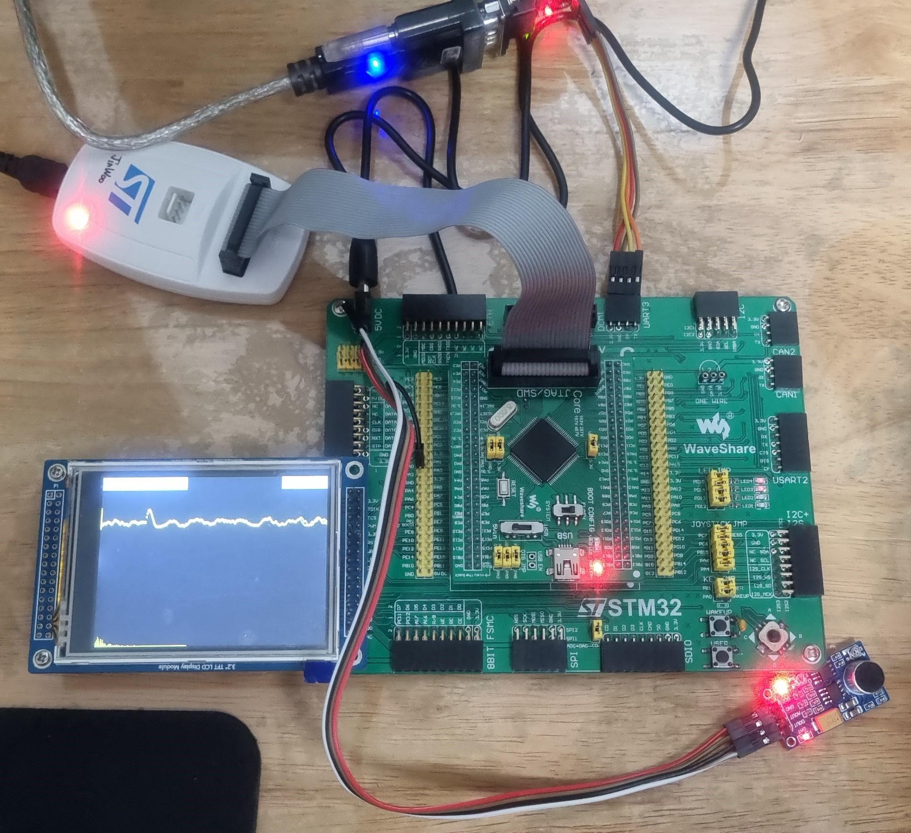
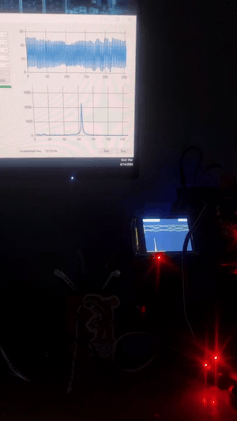

# Prj_FFT_STM32 — 실시간 FFT 스펙트럼 분석기 (FreeRTOS)



> WaveShare STM32F407 Core 보드 + 3.2" TFT LCD(FSMC) + ST-Link/JTAG, UART3, 마이크 모듈 구성. 상단에 시간 도메인 파형, 하단에 FFT 스펙트럼이 표시됩니다.

### 실시간 동작 영상



> 마이크 입력에 따라 상단 시간 도메인 파형과 하단 FFT 스펙트럼이 실시간으로 갱신되는 모습.

STM32F407 보드에서 ADC로 입력 신호를 샘플링하고, CMSIS-DSP의 radix-4 복소 FFT로 주파수 성분을 분석하여 TFT LCD에 **시간 도메인 파형**과 **주파수 스펙트럼**을 실시간으로 표시하는 펌웨어입니다. **FreeRTOS** 기반으로 ADC 수집 · FFT 연산 · UART 전송을 독립 태스크로 분리했고, **TIM3가 ADC를 하드웨어 트리거**하여 균일한 샘플링을 보장합니다. UART3로 PC(C# 모니터)에 원본/FFT 데이터를 전송합니다.

## 주요 기능

- **하드웨어 트리거 ADC 샘플링** — TIM3 TRGO가 ADC1을 균일한 주기로 트리거(DMA 수집), 샘플링 지터 없음
- **FFT 연산** — ARM CMSIS-DSP `arm_cfft_radix4_f32`, 256포인트 복소 FFT + 크기(magnitude)
- **신호 컨디셔닝** — DC 오프셋 제거 (균일 샘플링으로 노이즈가 낮아 윈도우/평활은 미적용)
- **로그(dB) 스펙트럼 표시** — 넓은 동적 범위를 압축해 포화 없이 표시
- **LCD 시각화** — 320×240 ILI9325 패널에 시간 도메인(상단) + FFT(하단) 동시 표시
- **UART 모니터** — UART3(115200) **인터럽트 기반 비차단 전송**으로 원본/FFT 프레임 전송
- **FreeRTOS 멀티태스킹** — 세마포어/큐/뮤텍스로 동기화

## 하드웨어 요구사항

| 항목 | 사양 |
|------|------|
| MCU | STM32F407VET6 (Cortex-M4F, 168 MHz) |
| 보드 | WaveShare Open407V-C 계열 |
| 디스플레이 | ILI9325 TFT LCD, 320×240, FSMC 인터페이스 |
| 터치 | 저항막 터치 패널 (SPI) |
| ADC 입력 | ADC1 Channel 0 (PA0) — 분석할 아날로그 신호 |
| 샘플링 타이머 | TIM3 (TRGO → ADC 트리거) |
| UART | USART3 (PC10/PC11), 115200 bps |
| 디버거 | ST-Link |

## 시스템 아키텍처 (FreeRTOS)

신호 처리를 3개의 태스크로 분리하고, ISR·태스크 간을 동기화 객체로 연결합니다.

```
 TIM3 Update ─TRGO→ ADC1 변환(균일) ─DMA→ AdcVal
                          │ 변환완료 IRQ
                          ▼ (sampleTickSem)
   ┌──────────┐  fftQueue   ┌──────────┐  uartReadySem  ┌───────────┐
   │ AdcTask  │ ──(핑퐁)──→ │ FftTask  │ ─────────────→ │ UartTask  │
   │ 우선순위3 │             │ 우선순위1 │                │ 우선순위2  │
   └──────────┘             └──────────┘                └───────────┘
   샘플 수집 +              DC제거·FFT·                  IT(비차단) 전송
   시간영역 LCD             dB LCD 표시                  ↑ uartTxDoneSem(TX완료 IRQ)
```

| 태스크 | 우선순위 | 역할 |
|--------|:---:|------|
| `AdcTask` | 3 (최고) | 변환완료마다 샘플 수집, 256개 모이면 FFT로 전달, 시간영역 LCD 표시 |
| `FftTask` | 1 (최저) | DC 제거 + FFT + 크기 + FFT LCD 표시(dB) |
| `UartTask` | 2 | 프레임 인코딩 후 인터럽트 기반 비차단 전송 |

| 동기화 객체 | 종류 | 용도 |
|------|------|------|
| `sampleTickSem` | 카운팅 세마포어 | ADC 변환완료 ISR → AdcTask (샘플 틱) |
| `fftQueue` | 큐 | AdcTask → FftTask (핑퐁 버퍼 인덱스) |
| `uartReadySem` | 바이너리 세마포어 | FftTask → UartTask (새 데이터 통지) |
| `uartTxDoneSem` | 바이너리 세마포어 | USART3 TX 완료 ISR → UartTask |
| `lcdMutex` | **뮤텍스** | LCD(FSMC) 공유 자원 보호 (AdcTask·FftTask) |
| `dataMutex` | **뮤텍스** | FFT 결과/시간영역 스냅샷 공유 보호 (FftTask·UartTask) |

> 신호 처리 코드는 [`Core/Src/app_tasks.c`](Core/Src/app_tasks.c)에 있습니다. 태스크 생성은 [`Core/Src/freertos.c`](Core/Src/freertos.c)의 `MX_FREERTOS_Init()`에서 `App_FreeRTOS_Init()`을 호출해 이뤄집니다.

## 신호 처리 사양

- **샘플링**: TIM3 (PSC=9, ARR=949, APB1 타이머 84 MHz) → 약 **8.84 kHz**, 하드웨어 트리거
- **나이퀴스트 주파수**: 약 4.42 kHz
- **FFT 크기**: 256 포인트, 주파수 분해능 ≈ 8842 / 256 ≈ **34.5 Hz/bin**
- **표시**: FFT_SIZE/2(=128) bin을 로그(dB) 스케일로 LCD에 막대 표시

## 핵심 동작 원리 — FFT 파이프라인

심장부는 [`Core/Src/app_tasks.c`](Core/Src/app_tasks.c) `FftTask`의 다음 CMSIS-DSP 호출입니다. 256개 샘플 블록마다 실행됩니다.

```c
arm_cfft_radix4_init_f32(&S, FFT_POINTS, 0, 1);  // 1) FFT 인스턴스 초기화 (시작 시 1회)
/* ... DC 오프셋 제거 ... */
arm_cfft_radix4_f32(&S, in);                     // 2) 복소 FFT 수행 (in-place)
arm_cmplx_mag_f32(in, mag, FFT_POINTS);          // 3) 각 주파수 빈의 크기(magnitude)
```

### 입력 데이터 구조: 왜 버퍼가 512인가?

FFT는 **복소수**를 다루므로 한 샘플마다 `[실수부, 허수부]` 두 개의 `float32`가 필요합니다. 256포인트 FFT를 위해 512 크기 버퍼에 인터리브 저장합니다.

```
adcBuf[] = [ re0, im0, re1, im1, ... , re255, im255 ]
             ▲    ▲
             │    └─ 허수부 = 0 (실제 신호이므로)
             └─ 실수부 = ADC 측정값 (AdcVal/4)
```

### 단계별 설명

**1️⃣ `arm_cfft_radix4_init_f32(&S, FFT_POINTS, 0, 1)`** — 트위들/비트반전 테이블을 인스턴스에 채움. 파라미터가 고정이라 **시작 시 1회만** 호출합니다.

| 인자 | 값 | 의미 |
|------|----|------|
| `fftLen` | 256 | FFT 포인트 수 (radix-4 → 4의 거듭제곱) |
| `ifftFlag` | 0 | 정방향 FFT(시간→주파수) |
| `bitReverseFlag` | 1 | 출력을 정상 순서로 정렬 |

**2️⃣ `arm_cfft_radix4_f32(&S, in)`** — radix-4 고속 푸리에 변환. **in-place 연산**으로 입력 버퍼를 복소 스펙트럼으로 덮어씁니다. Cortex-M4F의 FPU로 빠르게 동작.

**3️⃣ `arm_cmplx_mag_f32(in, mag, FFT_POINTS)`** — 각 빈의 크기 `sqrt(re² + im²)`를 계산. 이 값이 LCD 막대 그래프와 UART FFT 프레임이 됩니다.

### 신호 컨디셔닝 & 표시

연산 전후로 스펙트럼 품질을 높이는 처리를 적용합니다 ([`app_tasks.c`](Core/Src/app_tasks.c)):

1. **DC 오프셋 제거** — FFT 전 블록 평균을 빼서 저주파 과대 성분 억제
2. **로그(dB) 스케일** — `20·log10(mag)`를 `[FFT_DB_MIN, FFT_DB_MAX]` 구간으로 화면에 매핑(클램프)

> Hann 윈도우·IIR 평활은 초기에 적용했다가, TIM3 하드웨어 트리거로 샘플링이 균일해지면서 노이즈가 충분히 낮아져 **현재는 사용하지 않습니다.** 필요 시 `FftTask`에 다시 추가할 수 있습니다.

## 성능 개선 내역 (단일 루프 → FreeRTOS)

초기에는 단일 `while` 루프 구조였으나, 아래 단계를 거쳐 반응성과 신호 품질을 크게 개선했습니다.

### ① 단일 루프 → FreeRTOS 3-태스크 분리 *(반응성)*
- **문제**: 한 루프에서 UART 전송(블로킹, ~110 ms)이 끝날 때까지 FFT·LCD가 멈춰 화면이 끊김.
- **해결**: ADC 수집 / FFT / UART를 독립 태스크로 분리하고 우선순위로 시간 임계 작업(샘플링)을 보장.
- **효과**: UART 전송이 더 이상 FFT·LCD를 막지 않음 → 반응성 향상.

### ② UART 블로킹 폴링 → 인터럽트 기반 비차단 전송 *(전송 안정화)*
- **문제**: `HAL_UART_Transmit`(블로킹)이 최저 우선순위 태스크에서 CPU를 점유, 무거운 FFT 태스크에 밀려 **전송이 멈추는 기아(starvation)** 발생.
- **해결**: `HAL_UART_Transmit_IT` + TX 완료 세마포어(`uartTxDoneSem`). 전송 중에는 잠들어 CPU를 양보, UartTask 우선순위를 FFT보다 높임.
- **효과**: 전송이 다른 태스크를 막지 않으면서 안정적으로 완료.

### ③ 소프트웨어 샘플링 → TIM3 하드웨어 트리거 ADC *(신호 품질 — 가장 큰 개선)*
- **문제**: 태스크 스케줄링 지터 + free-running ADC의 비동기 읽기로 **샘플링 시점이 불균일** → 스펙트럼에 노이즈/위상 잡음.
- **해결**: TIM3 TRGO(Update)가 ADC를 **하드웨어로 균일하게 트리거**, 변환완료 인터럽트(`HAL_ADC_ConvCpltCallback`)로 수집.
- **효과**: 완벽히 균일한 샘플링 → 위상 노이즈/누설 급감, 스펙트럼이 깨끗해짐.

#### 왜 더 깨끗해지는가 — "샘플 시점을 누가 정하나"

두 방식 모두 **타이머(PSC/ARR)로 샘플링 주파수를 정하는 것은 동일**합니다. 차이는 타이머 이벤트가 *실제 샘플 시점*을 어떻게 결정하느냐입니다.

```
[기존] TIM 인터럽트/플래그 ─→ CPU가 "지금 읽자" ─→ AdcVal 읽기
                                                  ↑ ADC는 타이머와 무관하게 연속 변환 중
   → 샘플 시점이 (1) CPU 읽기 지연(스케줄링/부하)과
                 (2) free-running ADC 비동기 로 매번 흔들림 = 지터

[현재] TIM3 Update ─TRGO(하드웨어)─→ ADC 변환 시작 ─DMA─→ 저장
   → 타이머 이벤트로부터 항상 같은 지연에 샘플 = 완벽히 균일
```

- FFT는 **모든 샘플이 정확히 같은 간격 Δt로 찍혔다고 가정**합니다. 간격이 흔들리면(지터) 위상 변조가 섞인 것과 같아 에너지가 여러 bin으로 번지고 노이즈 바닥이 올라갑니다. 지터를 없애니 바닥이 내려가고 피크가 또렷해집니다.
- 타이머→ADC 사이에 **일정한 지연**이 있어도 무방합니다. 스펙트럼 크기는 샘플 *간격의 균일성*에만 영향받고, 일정 지연은 위상에만 들어가기 때문입니다. (기존 문제는 지연이 *매번 달랐던* 것)

> **샘플링 주파수는 여전히 `TIM3`의 PSC/ARR로 자유 조절 가능**합니다. 단 **ADC 변환 시간 ≤ 타이머 주기**여야 합니다(현재 8비트·480사이클 ≈ 47µs ≤ 113µs). 더 높은 fs가 필요하면 ADC Sampling Time을 줄이면 됩니다.

### ④ 신호 컨디셔닝 *(노이즈/누설)*
- **DC 오프셋 제거**로 저주파 과대 성분을 억제.
- (초기에는 Hann 윈도우·IIR 평활도 적용했으나, ③의 균일 샘플링으로 노이즈가 충분히 낮아져 현재는 DC 제거만 유지.)

### ⑤ 선형 → 로그(dB) 표시 스케일 *(표시 품질)*
- magnitude 동적 범위(최대 ~수만)를 dB로 압축 → 포화 없이 스펙트럼 형태 표현.

### 함께 수정한 버그
- **Raw 프레임에 FFT 데이터가 실리던 버그**: in-place FFT가 입력을 덮어쓰기 *전에* 시간영역 스냅샷을 저장하도록 순서 수정.
- **FFT 막대 폭주**: `DrawLine` y좌표가 `uint16_t`로 래핑되어 거대 막대가 그려지던 문제 → 화면 높이로 **클램프**.
- **FFT 매 사이클 재초기화** 제거 → 시작 시 1회만.

> 종합하면, **반응성**은 ①②, **신호 품질**은 ③④, **표시**는 ⑤가 핵심입니다. 특히 ③(하드웨어 트리거 샘플링)이 노이즈 개선에 가장 크게 기여했습니다.

## 빌드 & 플래시

본 프로젝트는 **STM32CubeIDE** 프로젝트이며 **FreeRTOS(CMSIS-RTOS V1)** 미들웨어를 사용합니다.

1. STM32CubeIDE 실행 → `File > Open Projects from File System...` 로 저장소 import
2. `Project > Build All` 로 빌드
3. ST-Link 연결 후 `Run > Debug` 로 플래시

- CMSIS-DSP(`arm_math`)와 FreeRTOS 커널은 빌드 설정/미들웨어에 포함되어 있습니다.
- 주변장치/RTOS 설정을 바꾸려면 [`FFT_Mutex.ioc`](FFT_Mutex.ioc)를 CubeMX로 엽니다.

### CubeMX 핵심 설정 (재생성 시 유지 필요)
- **ADC1**: Continuous=Disabled, External Trigger Source=**Timer 3 Trigger Out event**, Edge=Rising, DMA Continuous Requests=Enabled
- **TIM3**: Trigger Event Selection(TRGO)=**Update Event**
- **NVIC**: DMA2_Stream0 / USART3 인터럽트 우선순위 ≥ 5 (FreeRTOS `configMAX_SYSCALL_INTERRUPT_PRIORITY`)
- **FreeRTOS**: `USE_COUNTING_SEMAPHORES`, `USE_MUTEXES` 활성화

## 주요 튜닝 파라미터

[`Core/Src/app_tasks.c`](Core/Src/app_tasks.c) 상단 `#define`:

| 파라미터 | 기본값 | 설명 |
|---|---|---|
| `FFT_DB_MIN` | 45.0 | 이 dB 이하 = 막대 없음(바닥). 노이즈 플로어가 보이면 ↑ |
| `FFT_DB_MAX` | 90.0 | 이 dB 이상 = 최대 높이로 클램프 |
| `FFT_MAX_HEIGHT` | 200 | 막대 최대 높이(px) |

## UART 프로토콜

`UartTask`가 매 FFT 사이클마다 UART3로 두 프레임을 전송합니다 (인코딩: `Build_RawFrame` / `Build_FftFrame`).

- **원본(시간영역) 프레임**: `0x03 0x15 0x01` + 길이(2바이트) + 1바이트 샘플 × 256
- **FFT(주파수영역) 프레임**: `0x03 0x15 0x02` + 길이(2바이트) + float32(리틀엔디안) × 256

## 프로젝트 구조

```
Prj_FFT_STM32/
├── Core/
│   ├── Inc/
│   │   ├── app_tasks.h          # FreeRTOS 태스크 인터페이스
│   │   ├── FreeRTOSConfig.h     # FreeRTOS 커널 설정
│   │   └── ...                  # main.h, 주변장치, LCD, 폰트
│   ├── Src/
│   │   ├── app_tasks.c          # ★ ADC/FFT/UART 태스크 + 신호처리
│   │   ├── freertos.c           # MX_FREERTOS_Init (App_FreeRTOS_Init 호출)
│   │   ├── main.c               # 초기화 + 스케줄러 시작
│   │   ├── adc.c / tim.c        # ADC(TIM3 트리거) / TIM3 설정
│   │   └── ...                  # LCD/터치 드라이버 등
│   └── Startup/
├── Drivers/                     # STM32 HAL & CMSIS(DSP)
├── Middlewares/                 # FreeRTOS 커널
├── docs/
│   ├── hardware_demo.jpg
│   └── references/              # FFT 참고 자료 (PDF, Excel 예제)
├── FFT_Mutex.ioc                # STM32CubeMX 설정
└── README.md
```

## 참고 자료 (References)

FFT를 펌웨어로 구현하기에 앞서, **Excel로 시간 영역 → 주파수 영역 변환 과정을 먼저 검증**하며 원리를 이해했습니다.

- **[Frequency Domain Using Excel](docs/references/Excel_FFT_Instructions.pdf)** — Larry Klingenberg, San Francisco State University (April 2005). Excel *Analysis ToolPak → Fourier Analysis* 로 FFT 복소수·크기 스펙트럼을 그리는 단계별 가이드.
- **[FFT 예제 스프레드시트](docs/references/FFT_example.xlsx)** — Signal Generator로 주파수를 생성해 Oscilloscope에 연결, 그 데이터를 엑셀로 추출하여 위 가이드대로 작업했습니다. 이를 통해 FFT 구현에 중요한 척도·파라미터(샘플 수, 샘플링 주파수, 분해능 등)를 학습했습니다.
  - 컬럼: `second`(시간) · `Volt`(샘플) · `FFT Freq` · `FFT complex` · `FFTmag` / 파라미터: `Data length(D)`, `sampling time(t)`, `sampling Freq(Fs)`

### Excel 방법 ↔ 펌웨어 구현 대응

| Excel 방법 | 본 펌웨어 |
|------------------|----------------|
| Fourier Analysis → `FFT complex` | `arm_cfft_radix4_f32()` 출력 |
| `=2/sa * IMABS(E2)` → `FFTmag` | `arm_cmplx_mag_f32()` |
| `FFT freq = n × fs / sa` | 빈 간격 = fs / `FFT_POINTS` |
| 샘플 수 2ⁿ | `FFT_POINTS = 256` (radix-4) |
| sa/2 이상은 표시 안 함 | `FFT_POINTS/2`까지만 LCD 표시 |
